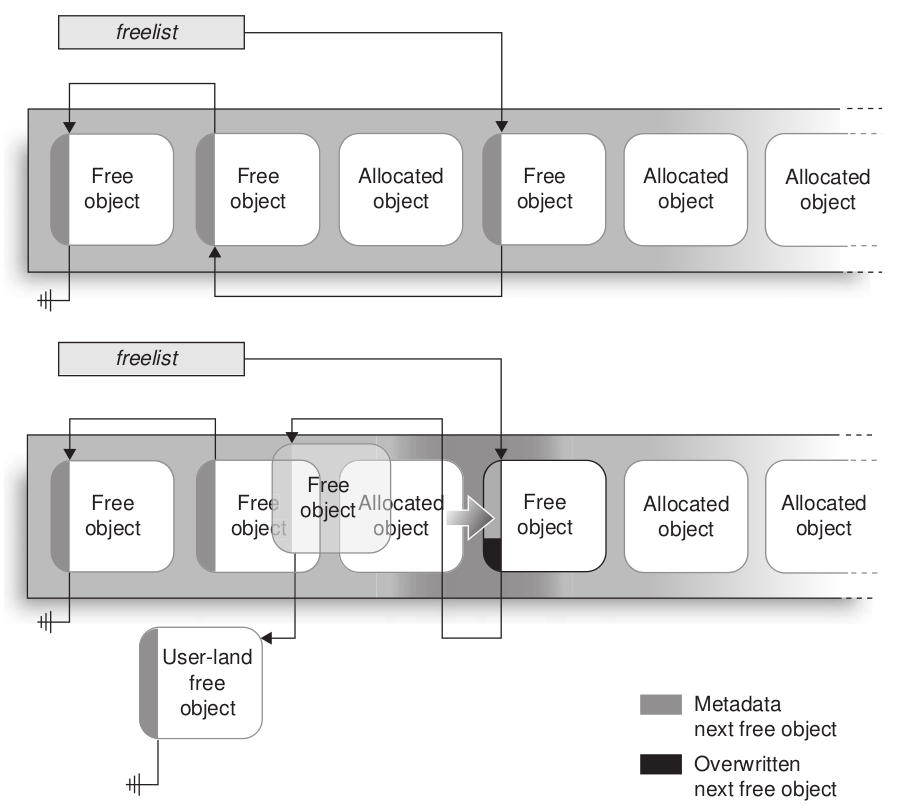

*Some thoughts and notes about kernel exploitation. Updating...*


## Attack The Core - CVE-2009-1046: set_selection() off-by-two

Although we can only overflow two bytes on the SLUB allocator, we can gradually open the evil gate for us. In this exploitation, we corrupted data struct in the next free object, made its free list pointer points to a nearby (cause we could corrupt just two bytes) no-align fake object which we can construct the whole free list pointer to a fake object totally constructed by us in user space. BTW, we don't consider the SMAP here.



This actually reminds me that when we dev, if some structs in data are constant in their lifetime, we shouldn't just make them all writable. Instead, we should force them to be const (Principle of least privilege). Give an example, if the last two bytes of our address are always being zero, we can:

```c
void *p = input();
return p & ~0xFFFF;
// or
void *p = input(); // without least two bytes
return p << 16;
```


## [Exploiting CVE-2017-5123 with full protections. SMEP, SMAP, and the Chrome Sandbox!](https://salls.github.io/Linux-Kernel-CVE-2017-5123/)

1. Spray payload or victims, which increases the possibility of success, and (brute force) probe are both can be used to against ASLR.

2. Padding, especially padding in the middle or beginning of struct, is Evil, for instance:

```c
struct siginfo {
    int si_signo;
    int si_errno;
    int si_code;
    int padding;   // this remains unchanged by waitid
    int pid;       // process id
    int uid;       // user id
    int status;    // return code
}
```

Since it's easy for us to control the least byte in pid, we can overwrite arbitrary 5 bytes plus 3 zeros (si_code is an unsigned int under 256), thus becoming an 8 bytes address!

On the contrary, if we use padding with union, like:

```c
typedef struct siginfo {
	union {
		__SIGINFO;
		int _si_pad[SI_MAX_SIZE/sizeof(int)];
	};
} __ARCH_SI_ATTRIBUTES siginfo_t;
```

Now the padding space is above all the elements in struct, since controlling the most byte usually more difficult than the least byte, this is safer.

3. When we probe the kernel, we can currently detect the status of the kernel from user space, deciding when we find the victim or result. For example, when we use ret2dir and can't find the offset of it, we can allocate a very large amount of memory in userland. Then try randomly overwriting pages in the kernel’s physmap, while simultaneously checking if the userland page has changed. If we see a change, then we have found a kernel virtual address that corresponds to a userland address and we can write to userland to create our payload in kernel memory.

4. If a region is RW but not X, it doesn't mean we can't corrupt this region to hijack the control flow to the payload, an example is that we can construct a fake object which contains function pointers, then we trigger the path to these pointers.
