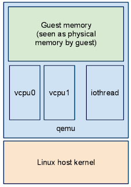
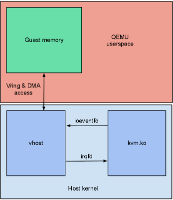

*Format: category - year - title - (abstract or review)*

 

# Virtualization & Emulation

 

## Fundamentals
Paper - 1974 - **[Formal requirements for virtualizable third generation architectures](http://citeseerx.ist.psu.edu/viewdoc/download?doi=10.1.1.141.4815&rep=rep1&type=pdf)** - Define a set of conditions sufficient for a computer architecture to support system virtualization efficiently, the short version can be viewed on [wikipedia](https://en.wikipedia.org/wiki/Popek_and_Goldberg_virtualization_requirements).

 

Paper - 1993 - **[Shade: A Fast Instruction-Set Simulator for Execution Profiling](http://pages.cs.wisc.edu/~remzi/Classes/838/Spring2013/Papers/cmelik93shade.pdf)** - 

 

Lecture - Updating - **[EECS 700 - Virtual Machines](http://www.ittc.ku.edu/~kulkarni/teaching/EECS768/index.html)** - 

 

## Architecture Related

Doc - Updating - **[Armv8-A Virtualization](https://developer.arm.com/architectures/learn-the-architecture/armv8-a-virtualization/single-page)** - describes the virtualization support in Armv8-A AArch64. Topics covered include stage 2 translation, virtual exceptions, and trapping. 

 

Article - 2015 - **[An in-depth look into the ARM virtualization extensions](https://genode.org/documentation/articles/arm_virtualization)** - From a practical way to inspect the extended ARM v7 architecture which supports virtualization, like how can we integrate virtualization into OS without increasing the trusted computing base (TCB) of applications that run beside virtual machines? Moreover, how can we make the virtual machine monitor (VMM) of one virtual machine (VM) independent of others.

 

Doc - Updating - **[Intel® 64 and IA-32 Architectures Software Developer's Manual Volume 3C: System Programming Guide, Part 3](https://software.intel.com/content/www/us/en/develop/download/intel-64-and-ia-32-architectures-sdm-volume-3c-system-programming-guide-part-3.html)** - Volume 3C covers system management mode, virtual machine extensions (VMX) instructions, and Intel® Virtualization Technology (Intel® VT).

Doc - Updating - **[Intel® Virtualization Technology FlexMigration (Intel® VT FlexMigration) Application Note](https://software.intel.com/content/www/us/en/develop/download/intel-virtualization-technology-flexmigration-intel-vt-flexmigration-application-note.html)** - This application note discusses virtualization capabilities in Intel® processors that support Intel® VT FlexMigration which is a part of Intel VT that allows a virtual-machine monitor (VMM) to report a consistent set of available processor features to guest software running in a virtual machine (VM), thereby broadening the live-migration compatibility pool across generations of Intel® processors.

Doc - Updating - **[Intel® Virtualization Technology for Directed I/O Architecture Specification](https://software.intel.com/content/www/us/en/develop/download/intel-virtualization-technology-for-directed-io-architecture-specification.html)** - This document describes the Intel® Virtualization Technology for Directed I/O.

 

Paper - 2006 - **[Vmware: A Comparison of Software and Hardware Techniques for x86 Virtualization](https://www.vmware.com/pdf/asplos235_adams.pdf)** - When Intel and AMD just introduced architectural extensions to support classical trap-and-emulate virtualization, vmware staff compared an existing software VMM with a new VMM designed for the emerging hardware support. Surprisingly, the hardware VMM often suffers lower performance than the pure software VMM. They find that the hardware support fails to provide an unambiguous performance advantage for two primary reasons: first, it offers no support for MMU virtualization; second, it fails to co-exist with existing software techniques for MMU virtualization. Keywords: Virtualization, Virtual Machine Monitor, Dynamic Binary Translation, x86, VT, SVM, MMU, TLB, Nested Paging. **IMHO, you can just read the Paper below.**

Paper - 2010 - **[Vmware: The evolution of an x86 virtual machine monitor](http://course.ece.cmu.edu/~ece845/docs/vmware-evolution.pdf)** - Vmware staff's views on how the x86 architecture was originally virtual- ized in the days of the Pentium II (1998), and follow the evolution of the virtual machine monitor forward through the introduction of virtual SMP, 64 bit (x64), and hard-ware support for virtualization to finish with a contemporary challenge, nested virtualization. Topics include: Virtual Machine Monitor and hypervisor, Dynamic Binary Translation/Adaptive BT, Shadow Page Tables, Segmentation, vSMP, VT, VT-x and AMD-V, Nested Paging, and time measure, record/replay capability with instruction-for-instruction accuracy, NUMA support. Souptik Sen wrote a great review:  [The Evolution of an x86 Virtual Machine Monitor: Review](https://souptikji.github.io/blog/2018/04/VM)

Article - 2012 - **[Vmware: Bringing Virtualization to the x86 Architecture with the Original VMware Workstation](http://citeseerx.ist.psu.edu/viewdoc/download?doi=10.1.1.423.4009&rep=rep1&type=pdf)** - An extended version (51 pages!) of the old-days part of above paper which describes the historical context, technical challenges, and main implementation techniques used by VMware Workstation to bring virtualization to the x86 architecture in 1999, **including the IO emulation**.

 

Series - 2008 - **[Hardware Virtualization: the Nuts and Bolts](https://www.anandtech.com/show/2480/10)** - Explains the impact of **x86** hardware virtualization performance. Topics include: A Matter of Privileges, Virtualization Challenges, Binary Translation, System Calls, I/O Virtualization, Memory ManagementParavirtualization, Intel VT-x and AMD SVM, Intel's EPT and AMD's NPT, Standardization Please!, The Benchmarks, Conclusion and Bibliography.

 

Series/Code - Updating - **[Hypervisor-From-Scratch](https://github.com/SinaKarvandi/Hypervisor-From-Scratch)** - Course contains technical details to create a basic Virtual Machine based on **x86** hardware virtualization.. Topics include: Basic Concepts & Configure Testing Environment, Entering VMX Operation, Setting up Our First Virtual Machine, Address Translation Using Extended Page Table (EPT), Setting up VMCS & Running Guest Code, Virtualizing An Already Running System, Using EPT & Page-Level Monitoring Features, How To Do Magic With Hypervisor.

 

### Memory Monitoring

Doc - 2009 - **[Performance Evaluation of Intel EPT Hardware Assist](https://www.vmware.com/pdf/Perf_ESX_Intel-EPT-eval.pdf)** - Vmware's introduction about **x86** Extended Page Tables (EPT, Intel's implementation of [Second Level Address Translation (SLAT), also known as nested paging](http://en.wikipedia.org/wiki/Second_Level_Address_Translation), which is used to more efficiently virtualize the memory of guest VMs) and shadow page table technique, and they designed a experience to evaluated their performance.

 

Article - 2014 - **[Monitor Trap Flag (MTF) Usage in EPT-based Guest Physical Memory Monitoring](http://hypervsir.blogspot.com/2014/11/monitor-trap-flag-mtf-usage-in-ept.html)** - Monitor Trap Flag (MTF) is a flag specifically designed for single-stepping in x86/Intel hardware virtualization VT-x technology. When MTF is set, the guest will trigger a VM Exit after executing each instruction (need to consider NMI or other interrupt delivery boundary). This article reviewed a [paper](https://www.cerias.purdue.edu/assets/pdf/bibtex_archive/2013-5.pdf) which presents an idea to use MTF for memory write allowing when monitoring modification to guest virtual-to-physical mapping (page table entries) tables. 

 

## Hypervisor & VMM & Emulator

 

### VirtualBox

Doc - Updating - **[Virtualbox Technical documentation](https://www.virtualbox.org/wiki/Technical_documentation)** - 

Doc - Updating - **[Virtualbox Timeline/Changes](https://www.virtualbox.org/timeline?from=09%2F24%2F2020&daysback=15&authors=&changeset=on&update=Update)** - 

Book/Article - 2013 - **[Oracle VM VirtualBox architecture](https://subscription.packtpub.com/book/virtualization_and_cloud/9781782177821/1/ch01lvl1sec14/oracle-vm-virtualbox-architecture)** - 

Book/Article - 2010 - **[Inside Oracle VM VirtualBox](https://www.informit.com/articles/article.aspx?p=1627061)** - 

 

### QEMU/KVM

Series - 2011 - **[QEMU Internals: Overall architecture and threading model](http://blog.vmsplice.net/2011/03/qemu-internals-overall-architecture-and.html)** /  **[QEMU Internals: Big picture overview](http://blog.vmsplice.net/2011/03/qemu-internals-big-picture-overview.html)**  - Talk about the hybrid architecture of qemu , which is mainly event-driven, aka a loop in the kernel: `softmmu/main.c:main()->softmmu/vl.c:qemu_init()->util/main-loop.c:qemu_main_loop()->softmmu/vl.c:qemu_cleanup()`. But it can also spawn worker threads which communicate with core qemu by pipe or fd. There is a big mutex in core qemu. Qemu uses signals to break out of the guest when execute guest code. For now qemu forks one process per VM, and spawns one thread per vCPU. 

**Update Note:  2020 - [QEMU Internals: Event loops](http://blog.vmsplice.net/2020/08/qemu-internals-event-loops.html) QEMU has several different types of threads: The vCPU threads, The main loop that runs the event loops, The IOThreads that run event loops for device emulation concurrently with vCPUs and "out-of-band" QMP monitor commands. vCPU threads do not run an event loop, they can add event sources (File descriptors, Event notifiers/eventfd, Timers, Bottom-halves) to the main loop or IOThread event loops and return back to guest code execution, which let callbacks run in the main loop thread or IOThreads later. The main loop has a glib GMainContext and two AioContext event loops (a single event loop function os_host_main_loop_wait() that calls qemu_poll_ns()). IOThreads have an AioContext and a glib GMainContext. AioContext is QEMU's native event loop API which has better features and performance. Code that relies on the AioContext aio_\*\(\) APIs will work with both the main loop and IOThreads. Older code using qemu_\*\(\) APIs only works with the main loop. Glib code works with both the main loop and IOThreads. The key difference between the main loop and IOThreads is that the main loop uses a traditional event loop that calls `qemu_poll_ns()` while IOThreads use AioContext `aio_poll()`.**

 

Series - 2011 - **[QEMU Internals: vhost architecture](http://blog.vmsplice.net/2011/09/qemu-internals-vhost-architecture.html)** - This post explains how vhost provides in-kernel virtio devices for KVM. Normally the QEMU userspace process emulates I/O accesses from the guest. Vhost puts virtio emulation code into the kernel, taking QEMU userspace out of the picture. This allows device emulation code to directly call into kernel subsystems instead of performing system calls from userspace. Vhost is a userspace interface and has no dependency on the KVM kernel module, this blog explained how the kvm model ,vhost thread and qemu communicate by descriptor (eventfd, irqfd, Vring, DMA). In the end, vhost instance only knows about the guest memory mapping, a kick eventfd, and a call eventfd. Keywords: `/dev/vhost-net`, `ioctl(2)`, `vhost-$pid`, `Linux: drivers/vhost/vhost.c, virt/kvm/eventfd.c`, `QEMU: hw/vhost.c`.

 

Notes - 2014 - **[QEMU Source Code Notes](https://chenyufei.info/notes/qemu-src.html) (kinda broken)** - flow chart about CPU & memory emulation,  softmmu, IRQState, timer, Module inrastructure, IO port emulation, Coroutine in QEMU.

 

Slides - 2010  - **[Architecture of the Kernel-based Virtual Machine (KVM)](http://www.linux-kongress.org/2010/slides/KVM-Architecture-LK2010.pdf)** - 

Slides - 2010  - **[KVM Architecture Overview (on Linux x86-64)](https://docs.google.com/present/view?id=ddd4skf9_889dwbvkpc4)** -  

# Vulnerability Discovery

 

## Fuzzing

Article - 2020 - **[Fuzzing战争：从刀剑弓斧到星球大战](https://www.secrss.com/articles/19781)** - 该文从历史演变的角度，阐述了 Fuzzing 进步和演变的过程，并特别对 Coverage-based greybox fuzzing(CGF) 和对应的改进进行了简单说明，最后展望了Fuzzing的发展方向：覆盖全类软件、CGF 依然主流、结合虚拟化机制的黑盒 Fuzzing 。（作者是前 Pwn2Own 冠军 Flanker Edward）

 

Paper - 2017 - **[Coverage-based Greybox Fuzzing as Markov Chain](https://mboehme.github.io/paper/TSE18.pdf)** - 

 

Paper - 2017 - **[Designing New Operating Primitives to Improve Fuzzing Performance](https://iisp.gatech.edu/sites/default/files/images/designing_new_operating_primitives_to_improve_fuzzing_performance_vt.pdf)** - 

 

## Tools

Doc - Updating - **[libFuzzer – a library for coverage-guided fuzz testing](https://llvm.org/docs/LibFuzzer.html)** - LibFuzzer is in-process, coverage-guided, evolutionary fuzzing engine, a good choice for testing libraries that have relatively small inputs, each input takes < 10ms to run, and the library code is not expected to crash on invalid inputs. This Doc describe the rules and tricks using LibFuzzer in a more theoretical way than the doc below. Topics include:  fuzz targets and their requirements, fuzzer binary usages and flags, Corpus, Parallel Fuzzing, Fork mode (Experimental), Resuming merge, common options, output format, Dictionaries, CMP instructions tracing and value profile (Experimental), `FUZZING_BUILD_MODE_UNSAFE_FOR_PRODUCTION` build macro, Startup initialization, Libfuzzer as library, when libfuzzer is not a good choice, etc.

Doc - Updating - **[libFuzzer Tutorial by Google](https://github.com/google/fuzzing/blob/master/tutorial/libFuzzerTutorial.md)** - Practical version of above one. Additions include examples, Competing bugs, Minimizing a reproducer, Visualizing Coverage, Other sanitizers, Distributed Fuzzing, Continuous fuzzing, problems about OOMs, Leaks, Timeouts and Slow inputs.

Doc - Updating - **[Structure-Aware Fuzzing/custom (user-supplied) mutators](https://github.com/google/fuzzing/blob/master/docs/structure-aware-fuzzing.md)** - 

Doc - Updating - **[Clang AddressSanitizer](http://clang.llvm.org/docs/AddressSanitizer.html)** - 

Doc - Updating - **[Clang UndefinedBehaviorSanitizer](https://clang.llvm.org/docs/UndefinedBehaviorSanitizer.html)** - 

Doc - Updating - **[Clang MemorySanitizer (support is experimental)](https://clang.llvm.org/docs/SanitizerCoverage.html#sanitizercoverage)** - 

Doc - Updating - **[Clang SanitizerCoverage](https://clang.llvm.org/docs/SanitizerCoverage.html#sanitizercoverage)** - 

# VirtVul

Article - 2015 - **[vmware-exploitation](https://github.com/xairy/vmware-exploitation)** - 

 

Article - 2019 - **[pwn2own-2020-oracle-virtualbox-escape](https://starlabs.sg/blog/2020/09/pwn2own-2020-oracle-virtualbox-escape/)** - (Read recursively)

 

Article - 2020 - **[Hunting for bugs in VirtualBox (First Take)](http://blog.paulch.ru/2020-07-26-hunting-for-bugs-in-virtualbox-first-take.html)** - 

 

Paper - 2020 - **[Agamotto: Accelerating Kernel Driver Fuzzing with Lightweight Virtual Machine Checkpoints](https://www.usenix.org/system/files/sec20-song.pdf)** - 

 

Paper - 2020 - **[USBFuzz: A Framework for Fuzzing USB Drivers by Device Emulation](https://www.usenix.org/system/files/sec20-peng_0.pdf)** - 

 

Paper - 2017 - **[Digtool: A Virtualization-Based Framework for Detecting Kernel Vulnerabilities](https://www.usenix.org/system/files/conference/usenixsecurity17/sec17-pan.pdf)** - an effective, binary-code-only, kernel vulnerability detection framework, built atop a virtualization monitor designed by 360 guys. Topics include: trace virtual memory with SPT, #PF (clear P flag in PTE), and MTP/TF; Inject interrupt to connect to debugger; monitor scheduling with trace writes to CurrentThread; use CPU Emulator to trace unprivileged cmp instruction to detect UNPROBE; delay free block reallocate time to detect UAF; instert redzone (unallocated block) to object to detect OOB; detect TOCTTOU by in the same syscall context by the length of interval of two memory accesses with same address. There is a Chinese review written by RoarTalk [零日竞赛：Google和360如何改变内核漏洞挖掘领域的规矩？](https://zhuanlan.zhihu.com/p/29641623). Questions include:

1. in 4.1.1 Virtual Page Monitor: to reduce performance cost, SPTs are only employed for the monitored threads (i.e., the fuzzer
   threads). For non-monitored threads, the original page tables in the guest OS are used. *But won't non-monitored threads corrupt memory of the hypervior since them control the virtual address to machine address process?*
2. in 4.1.1 Virtual Page Monitor: after get a #PF (page fault), digtool will (1) record the exception, or (2) inject a private interrupt (0x1c interrupt, which has not been used) into the guest OS. The private interrupt handler stores some information (e.g., the memory address that is accessed, and the instruction that causes the #PF) about the #PF exception. *I didn't get why there is a need to inster a private interrupt here. According to the following text, digtool connects to a debug tool by triggering another exception, such as software interruption, in the guest OS, not by the 0x1c interrupt.*
3. in 4.2.2 Detecting TOCTTOU Vulnerabilities: digtool judge whether two memory access events read the same address are in the same syscall contextby comparing the two events’ times with the Syscall/Trap2b/Trap2e event time and the RetUser event time. *But by this way we may miss some syscalls which can block. So if we can judge by user-space context, such as the cs:ip and ss:sp on stack, maybe we can achieve higher accuracy.*
4. in 4.3.2 Detecting OOB Vulnerabilities: An OOB vulnerability may be missed in some scenarios. Considering such situations, two memory blocks A and B are allocated and they are adjacent. A brittle program tries to access block A with a pointer and an offset, but the offset is so large that the accessed address locates in block B. This is an obvious OOB vulnerability. However, block B is also in the AVL tree, so it is difficult to detect this error. To solve this problem, Digtool will allocate an extra memory area with M bytes when a hooked memory allocation function is invoked. As a result, the total size of block A is sizeof(A)+M, and the start address of block B will be **backward** for M bytes. *But in this way we may overlook some situations where OOB happens as underflow instead of overflow. For example, a signed integer index overflow will get a negative number. So allocate redzones at both ends of A may be a better choice.* 

 

# Miscellaneous

Blog/Paper/Code - 2017 - **[SecDr](http://secdr.github.io/)** - SecDr 由一群关注信息安全的科研人员组成，主要交流科研写作与生活，侧重于以下几方面内容：论文写作技巧；期刊「SCI，EI」与会议「顶会，普会」的投稿；优质论文阅读与分享；最新安全动向交流。**但该网站目前（2017-2020）一直没有更新。但其公众号“安全学术圈”以及[github](https://github.com/secdr)仓库依然处于活跃状态**

 

